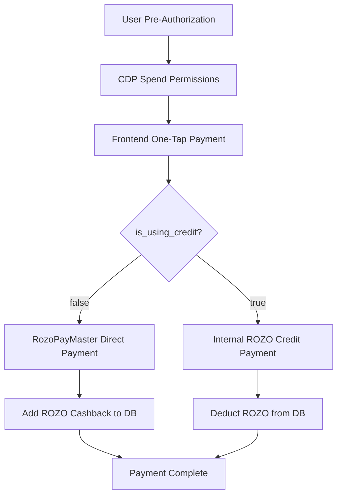

# CDP Spend Permissions & RozoPayMaster Integration

## Overview

This document outlines the integration of Coinbase CDP Spend Permissions with our RozoPayMaster contract for internalized payment and cashback system.

## 🎯 Goals

1. **Pre-authorized Payments**: Users pre-authorize spending through CDP Spend Permissions
2. **One-Tap Payments**: Frontend calls API without token selection
3. **Internalized Cashback**: Backend manages ROZO token accounting
4. **Dual Payment Modes**: Direct USDC payments vs ROZO credit payments

## 🏗️ Architecture

### Payment Flow Overview



### Contract Interaction

```
User Wallet <--> CDP Spend Permissions <--> RozoPayMaster <--> Merchant
     ^                                           |
     |                                           v
Backend API <-- ROZO Balance Management --> Database
```

## 🔧 Implementation Details

### 1. Pre-Authorization Setup

Users will pre-authorize spending through Coinbase's CDP Spend Permissions:

```typescript
// Frontend: Setup spend permission
const spendPermission = {
  account: userWalletAddress,
  spender: ROZO_PAYMASTER_ADDRESS,
  token: USDC_ADDRESS,
  allowance: parseUnits("1000", 6), // $1000 USDC
  period: 86400, // 24 hours
}
```

### 2. Payment API Design

**Endpoint**: `POST /payments/process`

**Request Parameters**:
```typescript
interface PaymentRequest {
  receiver: string;           // Merchant wallet address (e.g., "0x11", "0x22")
  cashback_rate: number;      // Percentage (e.g., 1, 5)
  amount: number;             // USD amount (e.g., 20, 0.1)
  is_using_credit: boolean;   // true = use ROZO credits, false = direct payment
  user_signature?: string;    // Optional: for additional verification
  nonce?: string;            // Optional: for replay protection
}
```

**Response**:
```typescript
interface PaymentResponse {
  success: boolean;
  data: {
    transaction_id: string;
    payment_method: "direct_usdc" | "rozo_credit";
    amount_paid_usd: number;
    rozo_balance_change: number; // Positive for earned, negative for spent
    new_rozo_balance: number;
    cashback_earned?: number;    // Only for direct payments
    tx_hash?: string;           // Only for direct payments
  };
}
```

### 3. Payment Processing Logic

#### Direct Payment Mode (`is_using_credit: false`)

1. **Validate Pre-Authorization**: Check CDP Spend Permissions
2. **Call RozoPayMaster**: Execute payment through smart contract
3. **Record Transaction**: Store blockchain transaction
4. **Calculate Cashback**: `amount * cashback_rate * 100` ROZO
5. **Update Balance**: Add ROZO to user's database balance

#### Credit Payment Mode (`is_using_credit: true`)

1. **Check ROZO Balance**: Verify user has sufficient ROZO credits
2. **Calculate Cost**: `amount * 100` ROZO tokens required
3. **Deduct ROZO**: Remove tokens from user's balance
4. **Internal Payment**: Use our treasury USDC to pay merchant
5. **Record Transaction**: Store internal payment record

## 🛠️ Smart Contract Integration

### RozoPayMaster Contract Interface

```solidity
// Simplified interface for RozoPayMaster
interface IRozoPayMaster {
    function processPayment(
        address user,
        address merchant,
        uint256 amount,
        bytes calldata signature
    ) external returns (bool);
    
    function getSpendPermission(address user) 
        external view returns (uint256 allowance, uint256 expiry);
}
```

### CDP Spend Permissions Integration

```typescript
// Check spend permission status
async function checkSpendPermission(userAddress: string): Promise<boolean> {
  const permission = await cdpSdk.getSpendPermission({
    account: userAddress,
    spender: ROZO_PAYMASTER_ADDRESS,
    token: USDC_ADDRESS
  });
  
  return permission.allowance > 0 && permission.expiry > Date.now();
}
```

## 💾 Database Schema Updates

### Enhanced Users Table

```sql
ALTER TABLE profiles ADD COLUMN IF NOT EXISTS 
  spend_permission_authorized BOOLEAN DEFAULT false,
  spend_permission_allowance NUMERIC DEFAULT 0,
  spend_permission_expiry TIMESTAMP,
  last_spend_permission_check TIMESTAMP;
```

### Enhanced Transactions Table

```sql
ALTER TABLE transactions ADD COLUMN IF NOT EXISTS
  payment_method VARCHAR(20) CHECK (payment_method IN ('direct_usdc', 'rozo_credit')),
  rozo_cost INTEGER DEFAULT 0,
  internal_payment BOOLEAN DEFAULT false,
  cdp_permission_used BOOLEAN DEFAULT false;
```

## 🔐 Security Considerations

### 1. Pre-Authorization Validation
- Always verify CDP Spend Permission before processing
- Check allowance and expiry timestamp
- Validate user signature for additional security

### 2. Replay Protection
- Use nonces for critical transactions
- Implement rate limiting per user
- Monitor for suspicious payment patterns

### 3. Balance Management
- Atomic ROZO balance updates
- Transaction rollback on failures
- Audit logs for all balance changes

## 📊 Example Scenarios

### Scenario 1: Direct Payment ($20 Service, 5% Cashback)

```json
// Request
{
  "receiver": "0x22",
  "cashback_rate": 5,
  "amount": 20,
  "is_using_credit": false
}

// Process
1. Check CDP pre-authorization ✓
2. Call RozoPayMaster.processPayment(user, 0x22, $20)
3. Transaction confirmed on blockchain
4. Calculate: 20 * 5 * 100 = 10,000 ROZO earned
5. Update user balance: +10,000 ROZO

// Response
{
  "success": true,
  "data": {
    "payment_method": "direct_usdc",
    "amount_paid_usd": 20,
    "rozo_balance_change": 10000,
    "cashback_earned": 10000,
    "tx_hash": "0xabc..."
  }
}
```

### Scenario 2: Credit Payment ($0.1 MCP Service)

```json
// Request
{
  "receiver": "0x11", 
  "cashback_rate": 1,
  "amount": 0.1,
  "is_using_credit": true
}

// Process
1. Check user ROZO balance ≥ 10 ROZO ✓
2. Deduct 10 ROZO from user balance
3. Internal payment: Treasury pays $0.1 USDC to 0x11
4. No additional cashback (already using credits)

// Response
{
  "success": true,
  "data": {
    "payment_method": "rozo_credit",
    "amount_paid_usd": 0.1,
    "rozo_balance_change": -10,
    "new_rozo_balance": 4990
  }
}
```

## 🚀 Implementation Steps

1. **Research & Setup**
   - [ ] Get RozoPayMaster contract address and ABI
   - [ ] Set up CDP SDK integration
   - [ ] Configure wallet connection for spend permissions

2. **Backend Implementation**  
   - [ ] Create new payment processing API
   - [ ] Implement CDP permission validation
   - [ ] Add ROZO credit system logic
   - [ ] Update database schema

3. **Frontend Integration**
   - [ ] Add spend permission authorization flow
   - [ ] Implement one-tap payment UI
   - [ ] Add balance display and management

4. **Testing & Deployment**
   - [ ] Test both payment modes
   - [ ] Verify cashback calculations
   - [ ] Security audit and testing

## 🔗 References

- [Coinbase CDP Spend Permissions](https://docs.base.org/base-account/improve-ux/spend-permissions)
- [Base Account Documentation](https://docs.base.org/base-account/)
- [OnchainKit Wallet Integration](https://onchainkit.xyz/)
