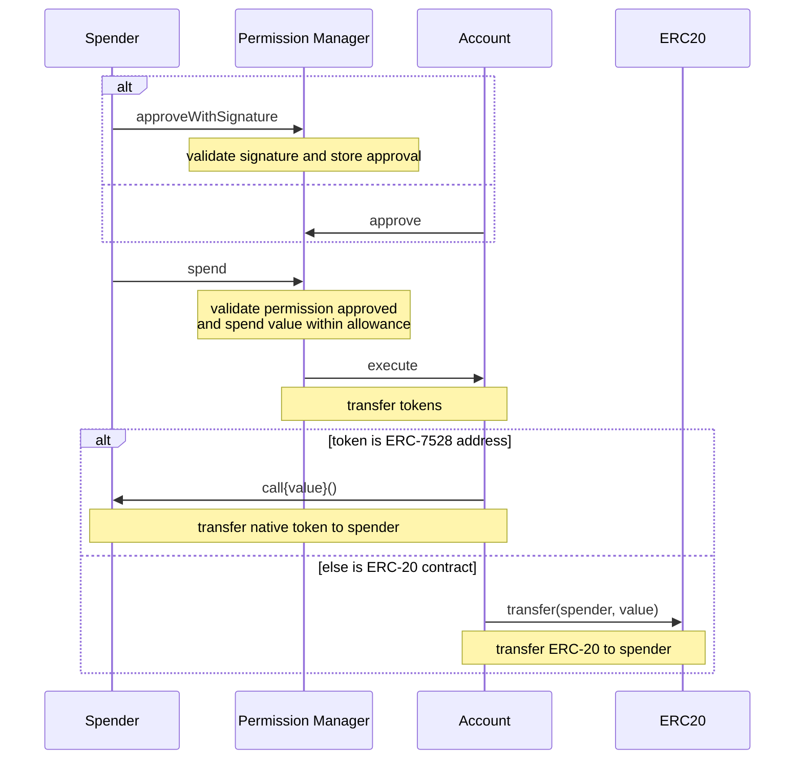

# Coinbase Spend Permissions 标准实现

根据 [官方 Coinbase Spend Permissions 仓库](https://github.com/coinbase/spend-permissions/tree/main) 的标准，我们实现了完整的"App approves and spends (onchain)"流程。

Based on the [official Coinbase Spend Permissions repository](https://github.com/coinbase/spend-permissions/tree/main) standard, we have implemented the complete "App approves and spends (onchain)" flow.

## 官方标准流程 (Official Standard Flow)

根据官方文档，Spend Permissions 的端到端流程包括：

According to the official documentation, the end-to-end Spend Permissions flow includes:

### 1. App requests and user signs permissions (offchain)
应用请求用户签名授权花费权限（离链操作）
Apps request users to sign spend permissions (offchain operation)

### 2. App approves and spends (onchain) 
应用调用批准和花费功能（链上操作）
Apps call approve and spend functions (onchain operation)



## 我们的实现 (Our Implementation)

### 合约配置 (Contract Configuration)

使用官方部署的合约地址：
Using officially deployed contract addresses:

```typescript
// Base Mainnet & Sepolia
SpendPermissionManager: '0xf85210B21cC50302F477BA56686d2019dC9b67Ad'
PublicERC6492Validator: '0xcfCE48B757601F3f351CB6f434CB0517aEEE293D'

// USDC Addresses
Base Mainnet: '0x833589fCD6eDb6E08f4c7C32D4f71b54bdA02913'
Base Sepolia: '0x036CbD53842c5426634e7929541eC2318f3dCF7e'
```

### 前端实现 (Frontend Implementation)

#### 1. 用户签名请求 (User Signature Request)
**位置**: `src/hooks/useCDPPermissions.ts`

```typescript
// Step 1: Get user signature for spend permission
const typedData = cdpClient.getTypedDataForSigning(spendPermission);

const signature = await signTypedDataAsync({
  domain: typedData.domain,
  types: typedData.types,
  primaryType: 'SpendPermission' as const,
  message: typedData.message,
});
```

#### 2. 执行标准流程 (Execute Standard Flow)
**位置**: `src/lib/cdp-client.ts`

```typescript
async executeSpendWithApproval(
  spendPermission: SpendPermission,
  signature: Hex,
  amountUSD: number,
  walletClient?: any
): Promise<{ approvalTxHash?: Hex; spendTxHash: Hex }>
```

**两步流程 (Two-step process)**:
1. `approveWithSignature(spendPermission, signature)` 
2. `spend(spendPermission, value)`

### 后端实现 (Backend Implementation)

#### Supabase Edge Function
**位置**: `supabase/functions/payments/process.ts`

```typescript
// Step 1: approveWithSignature (if not already approved)
if (signature) {
  const approveTxHash = await walletClient.writeContract({
    address: contracts.SpendPermissionManager,
    abi: spendPermissionABI,
    functionName: 'approveWithSignature',
    args: [spendPermission, signature],
  });
  
  // Wait for approval confirmation
  await publicClient.waitForTransactionReceipt({ hash: approveTxHash });
}

// Step 2: spend
const spendTxHash = await walletClient.writeContract({
  address: contracts.SpendPermissionManager,
  abi: spendPermissionABI,
  functionName: 'spend',
  args: [spendPermission, amountWei],
});
```

### SpendPermission 数据结构 (Data Structure)

根据官方标准的完整结构：
Complete structure according to official standard:

```typescript
interface SpendPermission {
  account: Address;      // 用户钱包地址 (User wallet address)
  spender: Address;      // 应用/支付方地址 (App/spender address)
  token: Address;        // 代币合约地址 (Token contract address)
  allowance: bigint;     // 允许花费数量 (Allowed spending amount)
  period: number;        // 周期长度(秒) (Period length in seconds)
  start: number;         // 开始时间戳 (Start timestamp)
  end: number;           // 结束时间戳 (End timestamp)
  salt: bigint;          // 随机盐值 (Random salt)
  extraData: Hex;        // 额外数据 (Extra data)
}
```

### EIP-712 签名标准 (EIP-712 Signature Standard)

我们使用官方的 EIP-712 类型定义：
We use the official EIP-712 type definitions:

```typescript
const SPEND_PERMISSION_TYPES = {
  SpendPermission: [
    { name: 'account', type: 'address' },
    { name: 'spender', type: 'address' },
    { name: 'token', type: 'address' },
    { name: 'allowance', type: 'uint256' },
    { name: 'period', type: 'uint48' },
    { name: 'start', type: 'uint48' },
    { name: 'end', type: 'uint48' },
    { name: 'salt', type: 'uint256' },
    { name: 'extraData', type: 'bytes' },
  ],
};
```

## 安全特性 (Security Features)

### 1. 仅支持原生和ERC-20代币 (Native and ERC-20 tokens only)
- ✅ 支持 ETH, USDC 等标准代币
- ❌ 不支持任意外部调用，提高安全性

### 2. 支付方发起调用 (Spender-originated calls)
- ✅ 应用从其 `spender` 地址调用
- ✅ 避免使用 ERC-4337 EntryPoint 的安全风险

### 3. 周期性限制 (Recurring period limits)
- ✅ 每日/每月花费限制
- ✅ 自动重置周期

## 测试和验证 (Testing and Validation)

### 测试环境设置 (Test Environment Setup)

1. **网络配置** (Network Configuration):
   ```bash
   # 使用 Base Sepolia 测试网
   # Use Base Sepolia testnet
   NEXT_PUBLIC_USE_MAINNET=false
   ```

2. **合约验证** (Contract Verification):
   ```bash
   # 验证合约地址是否正确
   # Verify contract addresses are correct
   SpendPermissionManager: 0xf85210B21cC50302F477BA56686d2019dC9b67Ad
   ```

### 测试步骤 (Test Steps)

1. **连接钱包** - 连接到 Base Sepolia
2. **授权签名** - 在 profile 页面创建 spend permission
3. **执行支付** - 使用 tap-to-pay 功能
4. **验证交易** - 在区块链浏览器查看交易

**验证项目** (Verification Items):
- ✅ `approveWithSignature` 交易成功
- ✅ `spend` 交易成功
- ✅ USDC 转账到商户地址
- ✅ 用户 ROZO 余额增加

## 部署状态 (Deployment Status)

✅ **前端更新** (Frontend Updated): 
- CDP 客户端支持标准流程
- 用户界面集成新的签名流程

✅ **后端更新** (Backend Updated):
- Supabase Edge Function 实现两步流程
- 支持 approveWithSignature + spend

✅ **已部署** (Deployed): `payments-process` function

## 合规性检查 (Compliance Checklist)

与官方标准的对比：
Comparison with official standard:

- ✅ 使用官方合约地址
- ✅ 实现 approveWithSignature 流程
- ✅ 实现 spend 流程
- ✅ 使用正确的 ABI
- ✅ EIP-712 签名格式正确
- ✅ SpendPermission 结构完整
- ✅ 支持多网络部署

## 下一步优化 (Next Optimizations)

1. **批量操作** (Batch Operations):
   - 实现 `executeBatch` 来合并 approve 和 spend
   
2. **权限缓存** (Permission Caching):
   - 检查已批准的权限，避免重复 approve
   
3. **Gas 优化** (Gas Optimization):
   - 实现智能 gas 估算和重试机制

4. **错误处理** (Error Handling):
   - 更精细的错误分类和用户提示

## 参考资料 (References)

- [Official Coinbase Spend Permissions Repository](https://github.com/coinbase/spend-permissions/tree/main)
- [SpendPermissionManager Contract](https://github.com/coinbase/spend-permissions/blob/main/src/SpendPermissionManager.sol)
- [Official Documentation](https://github.com/coinbase/spend-permissions/blob/main/docs)
